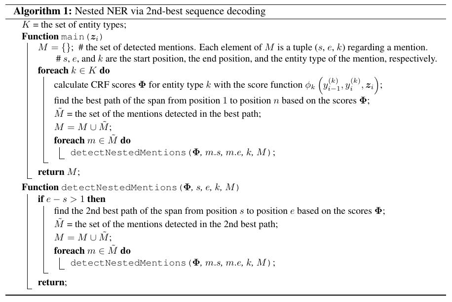

# 命名实体识别实验报告

*人工智能学院 周韧哲 181220076*

### 目录树

```shell
HW3
├── data                      #train,dev,test应该放在这里
│   ├── train.txt
│   ├── dev.txt  
│   ├── test.txt   
|   └── PubMed-shuffle-win-2.bin    #词向量
├── res              #结果文件夹
├── model            #NER Model相关实现
├── trainer.py       #管理训练过程
├── train_ner.py     #entry of program
├── utils     
└── ner.yaml         #实验配置文件
```

### 运行 

`Requirements: python==3.8.5, pytorch==1.6.0, cuda==10.1, numpy==1.19.1`，并且需要下载词向量[PubMed-shuffle-win-2.bin](https://github.com/cambridgeltl/BioNLP-2016)放在`/data`中。ner.yaml中可以调节随机种子、训练轮数、学习率等等。命令行键入`python train_ner.py`会用默认参数运行代码，结果保存在`/res/时间戳/181220076.txt`中，即为榜单结果。

### 具体实现

本次实验参考了[这个repo](https://github.com/yahshibu/nested-ner-tacl2020.git)，其论文为[Nested Named Entity Recognition via Second-best Sequence Learning and Decoding](https://arxiv.org/abs/1909.02250)。该论文提出了一个目标函数来进行模型的学习优化，以及一个迭代式的维特比解码方法，可以处理嵌套实体的情况且不需要额外的超参数。

具体实现基于CRF。为每个命名实体都分别建立了一个CRF模型，这样可以处理同一个span被指派为不同实体的情况。CRF的score function $\phi(y_{i-1},y_{i},z_i)$由两部分组成：一部分为state feature与其权重的乘积，即为$z_{i},y_i$与对应权重（包括偏置）的乘积；另一部分为transition feature，如果转移$y_{i-1}\rightarrow y_i$是合法的则取值为0，否则为$-\infty$，这一设定可以保证外部实体比内部实体分数要高。

解码时，使用外向-内向的方法，当识别出一个外层的实体后，再将这个实体作为新的句子，递归地对子句进行维特比解码来识别其子嵌套实体。当子句中没有实体被预测出来或者仅剩一个单词的实体时，递归结束。具体地，先对每个实体类型进行解码，对整个句子计算其CRF score，使用1-best维特比解码算法去解码整个句子序列，这属于1st level。完成后，对于1st level解码出来的实体，递归地解码其嵌套实体，直到到达递归边界。其伪代码如下图所示：



但是，这种方法也有一个问题，如果前面的迭代过程中出现了错误的识别，则这个错误可能会传递到后续迭代过程中，因此这种方法不太容易训练。

训练时，最大化正确标签序列的对数似然：
$$
\mathcal{L}(\theta)=\sum_k\log p(Y^k|Z;\theta)
$$
因为存在嵌套实体，因此对数似然可以分解为best path和secend best path两部分：
$$
\log p(Y^k|Z;\theta)=\mathcal{L}_{1st}(y_{1,1}^k,\cdots,y_{1,n}^k|Z;\theta)+\sum_{l>1}\sum_{j}\mathcal{L}_{2st}(y_{l,s_{l,j}^k}^k,\cdots,y_{l,e_{l,j}^k}^k|Z;\theta)
$$
模型搭建用的是广泛使用的BiLSTM-CRF模型，并使用词向量来构建输入，其实现位于`/model`中。使用Adam优化器，固定种子为0，设置batch size为32，在GTX 1660上训练一个epoch大约需要130s，完全训练完成需要数小时。程序开始运行时会生成一个时间戳，如20200120-123425，它会和当前种子一起生成一个文件夹如`/res/20200120-123425_seed0`，最终结果181220076.txt即保存在该文件夹下。目前的最好结果已经保存在`/res/181220076.txt`中。


